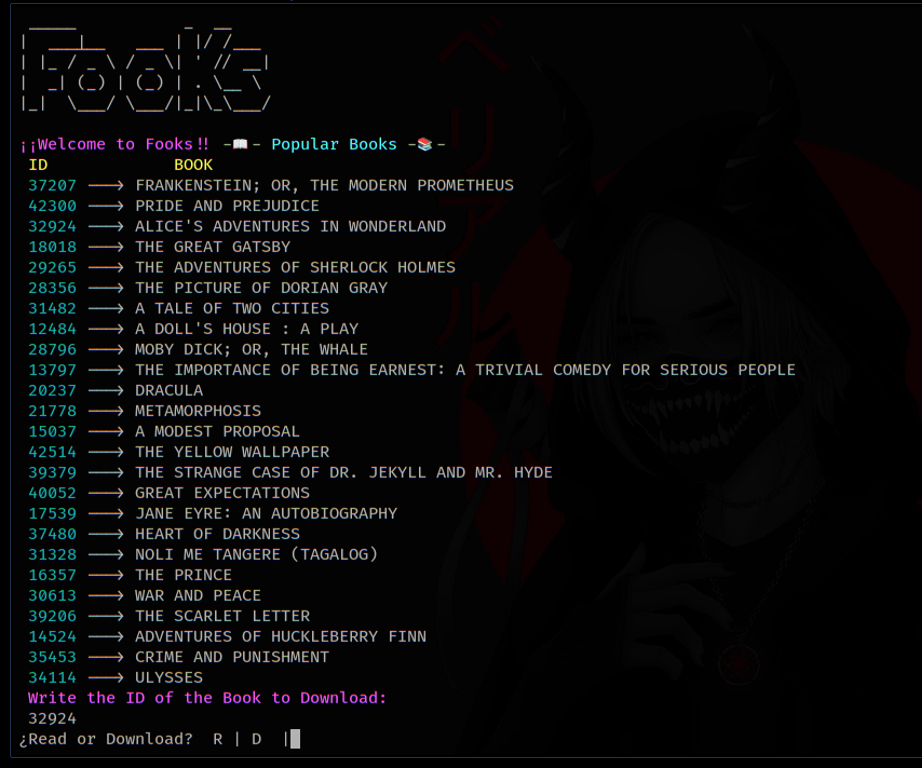

___
# 📚FooKs

**FooKs** is a bash program where you can read and download books for free on your terminal or command line, It is based on Project Gutenberg and is the fastest way to download and read books.
___
# Installation

```bash
git clone https://github.com/d4rp1/FooKs
```

```bash
cd FooKs
```
```bash
bash fooks
```
___
<p align="center">

</p>

___
